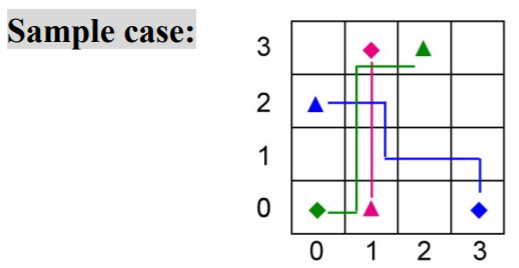
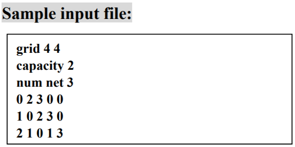
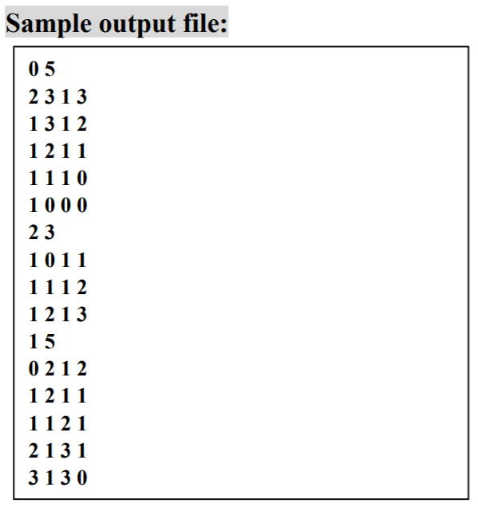

## Global Routing
Given the problem size (the number of horizontal and vertical tiles), capacity, and a netlist,
the global router routes all nets in the routing region. The objective is to minimize the total
overflows first and then the total wirelength. Here the overflow on a tile boundary is calculated
as the amount of demand that exceeds the capacity, i.e., overflow = max(0, demand - capacity). 
### Sample Case



### Usage
* Compile 
```sh
$ g++ router.cpp -std=c++11 -o router -O2
```
* Run
```sh
$ ./router [input file name] [output file name]
```
